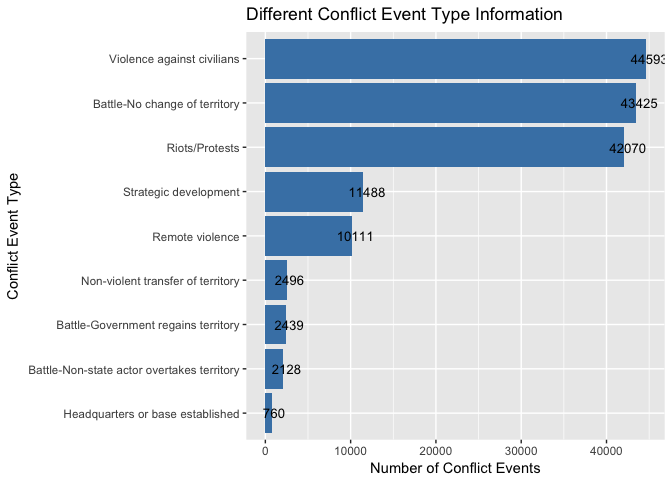

# Project Overview
In this project, I will use R and apply exploratory data analysis techniques to explore dataset of conflicts in Africa from 1997 to 2018, and the data is collected by the researchers at [ACLED](https://www.acleddata.com/).


# Dataset Overview 


```
## [1] 159515     28
```


```
##  [1] "ISO"              "EVENT_ID_CNTY"    "EVENT_ID_NO_CNTY"
##  [4] "EVENT_DATE"       "YEAR"             "TIME_PRECISION"  
##  [7] "EVENT_TYPE"       "ACTOR1"           "ASSOC_ACTOR_1"   
## [10] "INTER1"           "ACTOR2"           "ASSOC_ACTOR_2"   
## [13] "INTER2"           "INTERACTION"      "REGION"          
## [16] "COUNTRY"          "ADMIN1"           "ADMIN2"          
## [19] "ADMIN3"           "LOCATION"         "LATITUDE"        
## [22] "LONGITUDE"        "GEO_PRECISION"    "SOURCE"          
## [25] "SOURCE_SCALE"     "NOTES"            "FATALITIES"      
## [28] "TIMESTAMP"
```


```
## 'data.frame':	159515 obs. of  28 variables:
##  $ ISO             : num  12 12 12 12 12 12 12 12 12 12 ...
##  $ EVENT_ID_CNTY   : Factor w/ 159515 levels "4693.0","ALG1",..: 2 1113 2224 3335 4446 4715 4826 4937 5048 3 ...
##  $ EVENT_ID_NO_CNTY: num  1 2 3 4 5 6 7 8 9 10 ...
##  $ EVENT_DATE      : Factor w/ 7717 levels "1997-01-01 00:00:00",..: 1 2 3 4 5 6 6 7 7 7 ...
##  $ YEAR            : num  1997 1997 1997 1997 1997 ...
##  $ TIME_PRECISION  : num  1 1 1 1 1 1 1 1 1 1 ...
##  $ EVENT_TYPE      : Factor w/ 9 levels "Battle-Government regains territory",..: 9 9 9 9 9 2 9 6 6 2 ...
##  $ ACTOR1          : Factor w/ 3335 levels "\"Al Shabaab\" Militia",..: 849 849 849 849 849 2384 849 849 849 1685 ...
##  $ ASSOC_ACTOR_1   : Factor w/ 3252 levels "","\"Al Shabaab\" Militia",..: 1 1 1 1 1 1 1 1 1 1 ...
##  $ INTER1          : num  2 2 2 2 2 1 2 2 2 1 ...
##  $ ACTOR2          : Factor w/ 2874 levels "","\"Janjaweed\" Militia",..: 441 441 441 441 441 772 441 441 441 772 ...
##  $ ASSOC_ACTOR_2   : Factor w/ 2818 levels "","#FeesMustFall; Students (South Africa)",..: 1 1 1 1 1 1 1 1 1 1 ...
##  $ INTER2          : num  7 7 7 7 7 2 7 7 7 2 ...
##  $ INTERACTION     : num  27 27 27 27 27 12 27 27 27 12 ...
##  $ REGION          : Factor w/ 5 levels "Eastern Africa",..: 3 3 3 3 3 3 3 3 3 3 ...
##  $ COUNTRY         : Factor w/ 49 levels "Algeria","Angola",..: 1 1 1 1 1 1 1 1 1 1 ...
##  $ ADMIN1          : Factor w/ 754 levels "Abia","Abidjan",..: 694 594 25 91 694 25 694 576 25 694 ...
##  $ ADMIN2          : Factor w/ 4264 levels "","6th of October City",..: 1161 2651 3694 612 1161 937 1645 109 3694 1161 ...
##  $ ADMIN3          : Factor w/ 5016 levels "","3 De Fevereiro",..: 1 1 1 1 1 1 1 1 1 1 ...
##  $ LOCATION        : Factor w/ 18582 levels "10th of Ramadan City",..: 4836 6922 833 2533 4836 416 6787 429 833 4836 ...
##  $ LATITUDE        : num  36.7 36.1 36.8 36.5 36.7 ...
##  $ LONGITUDE       : num  2.789 0.883 3.042 2.829 2.789 ...
##  $ GEO_PRECISION   : num  1 1 3 1 1 1 1 1 1 1 ...
##  $ SOURCE          : Factor w/ 12509 levels ""," Agence France Presse",..: 12503 12503 12503 12503 12503 12503 12503 12503 12503 12503 ...
##  $ SOURCE_SCALE    : Factor w/ 32 levels "","International",..: 8 8 8 8 8 8 8 8 8 8 ...
##  $ NOTES           : Factor w/ 129317 levels ""," A farmer killed and a cattle-herder abducted by unknown gunmen on motorbikes in Woulango",..: 5964 115334 115337 5500 5965 5551 6426 48993 6696 42627 ...
##  $ FATALITIES      : num  5 2 2 16 18 4 23 7 20 0 ...
##  $ TIMESTAMP       : num  1.52e+09 1.52e+09 1.52e+09 1.52e+09 1.52e+09 ...
```

## Overview

There are 159515 data with 28 variables in the dataset.

## Variables Description:

  - **EVENT_ID_CNTY**: An individual identifier by number and country acronym
  - **EVENT_ID_NO_CNTY**: An individual numeric identifier
  - **EVENT_DATE**: The day, month and year on which an event took place
  - **YEAR**: The year in which an event took place
  - **TIME_PRECISION**: A numeric code indicating the level of certainty of the date coded for the event
  - **EVENT_TYPE**: The type of conflict event
  - **ACTOR1**: The named actor involved in the event
  - **ASSOC_ACTOR_1**:The named actor associated with or identifying ACTOR1
  - **INTER1**: A numeric code indicating the type of ACTOR1
  - **ACTOR2**: The named actor involved in the event
  - **ASSOC_ACTOR_2**: The named actor allied with or identifying ACTOR2
  - **INTER2**: A numeric code indicating the type of ACTOR2
  - **INTERACTION**: A numeric code indicating the interaction between types of ACTOR1 and ACTOR2
  - **REGION**: The region in which the event took place
  - **COUNTRY**: The country in which the event took place
  - **ADMIN1**: The largest sub-national administrative region in which the event took place
  - **ADMIN2**: The second largest sub-national administrative region in which the event took place
  - **ADMIN3**: The third largest sub-national administrative region in which the event took place
  - **LOCATION**: The location in which the event took place
  - **LATITUDE**: The latitude of the location
  - **LONGITUDE**: The longitude of the location
  - **GEO_PRECISION**: A numeric code indicating the level of certainty of the location coded for the event
  - **SOURCE**: The source of the event report
  - **NOTES**: A short description of the event
  - **FATALITIES**: The number of reported fatalities which occurred during the event
  


## Calculating Summary

### Summary Fatalities by Region


```
##     Min.  1st Qu.   Median     Mean  3rd Qu.     Max. 
##     0.00     0.00     0.00     4.53     1.00 25000.00
```

```
## df_new$REGION: Eastern Africa
##     Min.  1st Qu.   Median     Mean  3rd Qu.     Max. 
##    0.000    0.000    0.000    4.558    1.000 1369.000 
## -------------------------------------------------------- 
## df_new$REGION: Middle Africa
##     Min.  1st Qu.   Median     Mean  3rd Qu.     Max. 
##     0.00     0.00     0.00    11.59     2.00 25000.00 
## -------------------------------------------------------- 
## df_new$REGION: Northern Africa
##    Min. 1st Qu.  Median    Mean 3rd Qu.    Max. 
##    0.00    0.00    0.00    3.57    1.00 1300.00 
## -------------------------------------------------------- 
## df_new$REGION: Southern Africa
##    Min. 1st Qu.  Median    Mean 3rd Qu.    Max. 
##  0.0000  0.0000  0.0000  0.1547  0.0000 34.0000 
## -------------------------------------------------------- 
## df_new$REGION: Western Africa
##     Min.  1st Qu.   Median     Mean  3rd Qu.     Max. 
##    0.000    0.000    0.000    3.036    1.000 1000.000
```

  - The lowest fatalities in a conflict event is 0, the highest is 25000 and the mean value is around 4;
  - For diffierent Region:
    - _Eastern Africa_: The lowest fatalities in a conflict event is 0, the highest is 1369 and the mean value is around 4;
    - _Middle Africa_: The lowest fatalities in a conflict event is 0, the highest is 25000 and the mean value is around 11;
    - _Northern Africa_: The lowest fatalities in a conflict event is 0, the highest is 1300 and the mean value is around 3;
    - _Southern Africa_: The lowest fatalities in a conflict event is 0, the highest is 34 and the mean value is around 1;
    - _Western Africa_: The lowest fatalities in a conflict event is 0, the highest is 1000 and the mean value is around 3;
  - The highest fatalities number apppeared in Middle Africa, which we can furthuer look into it.
    
### Summary Fatalities by Country

The details of fatalities in different can be found below: 


```
##     Min.  1st Qu.   Median     Mean  3rd Qu.     Max. 
##     0.00     0.00     0.00     4.53     1.00 25000.00
```

```
## df_new$COUNTRY: Algeria
##    Min. 1st Qu.  Median    Mean 3rd Qu.    Max. 
##    0.00    0.00    0.00    2.65    2.00  321.00 
## -------------------------------------------------------- 
## df_new$COUNTRY: Angola
##    Min. 1st Qu.  Median    Mean 3rd Qu.    Max. 
##    0.00    0.00    0.00   45.32    2.00 5400.00 
## -------------------------------------------------------- 
## df_new$COUNTRY: Benin
##    Min. 1st Qu.  Median    Mean 3rd Qu.    Max. 
##  0.0000  0.0000  0.0000  0.3353  0.0000  8.0000 
## -------------------------------------------------------- 
## df_new$COUNTRY: Botswana
##    Min. 1st Qu.  Median    Mean 3rd Qu.    Max. 
## 0.00000 0.00000 0.00000 0.04444 0.00000 1.00000 
## -------------------------------------------------------- 
## df_new$COUNTRY: Burkina Faso
##    Min. 1st Qu.  Median    Mean 3rd Qu.    Max. 
##  0.0000  0.0000  0.0000  0.4863  0.0000 30.0000 
## -------------------------------------------------------- 
## df_new$COUNTRY: Burundi
##    Min. 1st Qu.  Median    Mean 3rd Qu.    Max. 
##   0.000   0.000   0.000   2.933   1.000 543.000 
## -------------------------------------------------------- 
## df_new$COUNTRY: Cameroon
##    Min. 1st Qu.  Median    Mean 3rd Qu.    Max. 
##   0.000   0.000   1.000   4.522   3.000 319.000 
## -------------------------------------------------------- 
## df_new$COUNTRY: Central African Republic
##    Min. 1st Qu.  Median    Mean 3rd Qu.    Max. 
##   0.000   0.000   0.000   3.231   2.000 200.000 
## -------------------------------------------------------- 
## df_new$COUNTRY: Chad
##    Min. 1st Qu.  Median    Mean 3rd Qu.    Max. 
##    0.00    0.00    0.00    9.64    3.00  400.00 
## -------------------------------------------------------- 
## df_new$COUNTRY: Democratic Republic of Congo
##      Min.   1st Qu.    Median      Mean   3rd Qu.      Max. 
##     0.000     0.000     0.000     6.594     1.000 25000.000 
## -------------------------------------------------------- 
## df_new$COUNTRY: Djibouti
##    Min. 1st Qu.  Median    Mean 3rd Qu.    Max. 
##  0.0000  0.0000  0.0000  0.8095  0.0000 27.0000 
## -------------------------------------------------------- 
## df_new$COUNTRY: Egypt
##    Min. 1st Qu.  Median    Mean 3rd Qu.    Max. 
##   0.000   0.000   0.000   1.426   1.000 409.000 
## -------------------------------------------------------- 
## df_new$COUNTRY: Equatorial Guinea
##    Min. 1st Qu.  Median    Mean 3rd Qu.    Max. 
##  0.0000  0.0000  0.0000  0.6923  0.0000 12.0000 
## -------------------------------------------------------- 
## df_new$COUNTRY: Eritrea
##    Min. 1st Qu.  Median    Mean 3rd Qu.    Max. 
##    0.00    0.00    0.00  194.64    2.25 1369.00 
## -------------------------------------------------------- 
## df_new$COUNTRY: Ethiopia
##    Min. 1st Qu.  Median    Mean 3rd Qu.    Max. 
##    0.00    0.00    0.00   11.73    4.00 1369.00 
## -------------------------------------------------------- 
## df_new$COUNTRY: Gabon
##    Min. 1st Qu.  Median    Mean 3rd Qu.    Max. 
##  0.0000  0.0000  0.0000  0.1646  0.0000  4.0000 
## -------------------------------------------------------- 
## df_new$COUNTRY: Gambia
##    Min. 1st Qu.  Median    Mean 3rd Qu.    Max. 
##  0.0000  0.0000  0.0000  0.6503  0.0000 54.0000 
## -------------------------------------------------------- 
## df_new$COUNTRY: Ghana
##     Min.  1st Qu.   Median     Mean  3rd Qu.     Max. 
##   0.0000   0.0000   0.0000   0.8408   0.0000 126.0000 
## -------------------------------------------------------- 
## df_new$COUNTRY: Guinea
##    Min. 1st Qu.  Median    Mean 3rd Qu.    Max. 
##   0.000   0.000   0.000   3.534   1.000 350.000 
## -------------------------------------------------------- 
## df_new$COUNTRY: Guinea-Bissau
##    Min. 1st Qu.  Median    Mean 3rd Qu.    Max. 
##   0.000   0.000   0.000   4.272   3.000 100.000 
## -------------------------------------------------------- 
## df_new$COUNTRY: Ivory Coast
##    Min. 1st Qu.  Median    Mean 3rd Qu.    Max. 
##   0.000   0.000   0.000   2.373   1.000 350.000 
## -------------------------------------------------------- 
## df_new$COUNTRY: Kenya
##    Min. 1st Qu.  Median    Mean 3rd Qu.    Max. 
##   0.000   0.000   0.000   1.663   1.000 213.000 
## -------------------------------------------------------- 
## df_new$COUNTRY: Lesotho
##    Min. 1st Qu.  Median    Mean 3rd Qu.    Max. 
##   0.000   0.000   0.000   1.632   1.000  25.000 
## -------------------------------------------------------- 
## df_new$COUNTRY: Liberia
##     Min.  1st Qu.   Median     Mean  3rd Qu.     Max. 
##   0.0000   0.0000   0.0000   0.9045   0.0000 113.0000 
## -------------------------------------------------------- 
## df_new$COUNTRY: Libya
##     Min.  1st Qu.   Median     Mean  3rd Qu.     Max. 
##    0.000    0.000    0.000    2.774    1.000 1300.000 
## -------------------------------------------------------- 
## df_new$COUNTRY: Madagascar
##    Min. 1st Qu.  Median    Mean 3rd Qu.    Max. 
##   0.000   0.000   0.000   1.679   1.000 113.000 
## -------------------------------------------------------- 
## df_new$COUNTRY: Malawi
##    Min. 1st Qu.  Median    Mean 3rd Qu.    Max. 
##  0.0000  0.0000  0.0000  0.3122  0.0000  9.0000 
## -------------------------------------------------------- 
## df_new$COUNTRY: Mali
##    Min. 1st Qu.  Median    Mean 3rd Qu.    Max. 
##   0.000   0.000   0.000   2.277   2.000 111.000 
## -------------------------------------------------------- 
## df_new$COUNTRY: Mauritania
##    Min. 1st Qu.  Median    Mean 3rd Qu.    Max. 
##  0.0000  0.0000  0.0000  0.2777  0.0000 24.0000 
## -------------------------------------------------------- 
## df_new$COUNTRY: Morocco
##    Min. 1st Qu.  Median    Mean 3rd Qu.    Max. 
##  0.0000  0.0000  0.0000  0.1317  0.0000 41.0000 
## -------------------------------------------------------- 
## df_new$COUNTRY: Mozambique
##    Min. 1st Qu.  Median    Mean 3rd Qu.    Max. 
##  0.0000  0.0000  0.0000  0.6484  0.0000 58.0000 
## -------------------------------------------------------- 
## df_new$COUNTRY: Namibia
##    Min. 1st Qu.  Median    Mean 3rd Qu.    Max. 
##  0.0000  0.0000  0.0000  0.4044  0.0000 28.0000 
## -------------------------------------------------------- 
## df_new$COUNTRY: Niger
##    Min. 1st Qu.  Median    Mean 3rd Qu.    Max. 
##   0.000   0.000   0.000   4.253   3.000 230.000 
## -------------------------------------------------------- 
## df_new$COUNTRY: Nigeria
##     Min.  1st Qu.   Median     Mean  3rd Qu.     Max. 
##    0.000    0.000    0.000    5.259    3.000 1000.000 
## -------------------------------------------------------- 
## df_new$COUNTRY: Republic of Congo
##    Min. 1st Qu.  Median    Mean 3rd Qu.    Max. 
##   0.000   0.000   0.000   1.477   0.000 100.000 
## -------------------------------------------------------- 
## df_new$COUNTRY: Rwanda
##    Min. 1st Qu.  Median    Mean 3rd Qu.    Max. 
##    0.00    0.00    1.00   11.88    9.00  700.00 
## -------------------------------------------------------- 
## df_new$COUNTRY: Senegal
##    Min. 1st Qu.  Median    Mean 3rd Qu.    Max. 
##   0.000   0.000   0.000   1.457   0.000 200.000 
## -------------------------------------------------------- 
## df_new$COUNTRY: Sierra Leone
##     Min.  1st Qu.   Median     Mean  3rd Qu.     Max. 
## 0.000000 0.000000 0.000000 0.008846 0.000000 5.000000 
## -------------------------------------------------------- 
## df_new$COUNTRY: Somalia
##    Min. 1st Qu.  Median    Mean 3rd Qu.    Max. 
##   0.000   0.000   0.000   1.664   1.000 512.000 
## -------------------------------------------------------- 
## df_new$COUNTRY: South Africa
##    Min. 1st Qu.  Median    Mean 3rd Qu.    Max. 
##  0.0000  0.0000  0.0000  0.1644  0.0000 34.0000 
## -------------------------------------------------------- 
## df_new$COUNTRY: South Sudan
##    Min. 1st Qu.  Median    Mean 3rd Qu.    Max. 
##   0.000   0.000   0.000   6.146   3.000 750.000 
## -------------------------------------------------------- 
## df_new$COUNTRY: Sudan
##     Min.  1st Qu.   Median     Mean  3rd Qu.     Max. 
##    0.000    0.000    0.000    7.759    2.000 1000.000 
## -------------------------------------------------------- 
## df_new$COUNTRY: Swaziland
##    Min. 1st Qu.  Median    Mean 3rd Qu.    Max. 
## 0.00000 0.00000 0.00000 0.08247 0.00000 2.00000 
## -------------------------------------------------------- 
## df_new$COUNTRY: Tanzania
##    Min. 1st Qu.  Median    Mean 3rd Qu.    Max. 
##   0.000   0.000   0.000   1.446   1.000 117.000 
## -------------------------------------------------------- 
## df_new$COUNTRY: Togo
##    Min. 1st Qu.  Median    Mean 3rd Qu.    Max. 
##  0.0000  0.0000  0.0000  0.5268  0.0000 11.0000 
## -------------------------------------------------------- 
## df_new$COUNTRY: Tunisia
##    Min. 1st Qu.  Median    Mean 3rd Qu.    Max. 
##  0.0000  0.0000  0.0000  0.2004  0.0000 54.0000 
## -------------------------------------------------------- 
## df_new$COUNTRY: Uganda
##    Min. 1st Qu.  Median    Mean 3rd Qu.    Max. 
##   0.000   0.000   0.000   3.026   2.000 530.000 
## -------------------------------------------------------- 
## df_new$COUNTRY: Zambia
##    Min. 1st Qu.  Median    Mean 3rd Qu.    Max. 
##   0.000   0.000   0.000   0.211   0.000  12.000 
## -------------------------------------------------------- 
## df_new$COUNTRY: Zimbabwe
##     Min.  1st Qu.   Median     Mean  3rd Qu.     Max. 
##  0.00000  0.00000  0.00000  0.07187  0.00000 13.00000
```

### Summary Conflict Event Type by Region
- There are totally 9 types of conflict event which are "Battle-Government regains territory,Battle-Non-state actor overtakes territory, Non-violent transfer of territory, Riots/Protests,  Violence against civilians, Battle-No change of territory, Headquarters or base established,   Remote violence, Strategic development". 
- The mostly happened conflict event is 'Violence against civilians' and the seldom happened conflict is 'Headquarters or base established'.
- The frequency of different conflict event happeded in different regions is shown below: 


```
##        Battle-Government regains territory 
##                                       2439 
##              Battle-No change of territory 
##                                      43425 
## Battle-Non-state actor overtakes territory 
##                                       2128 
##           Headquarters or base established 
##                                        760 
##          Non-violent transfer of territory 
##                                       2496 
##                            Remote violence 
##                                      10111 
##                             Riots/Protests 
##                                      42070 
##                      Strategic development 
##                                      11488 
##                 Violence against civilians 
##                                      44593
```

```
## df_new$REGION: Eastern Africa
##        Battle-Government regains territory 
##                                        495 
##              Battle-No change of territory 
##                                      20871 
## Battle-Non-state actor overtakes territory 
##                                        466 
##           Headquarters or base established 
##                                        145 
##          Non-violent transfer of territory 
##                                        587 
##                            Remote violence 
##                                       4143 
##                             Riots/Protests 
##                                       8585 
##                      Strategic development 
##                                       4522 
##                 Violence against civilians 
##                                      17137 
## -------------------------------------------------------- 
## df_new$REGION: Middle Africa
##        Battle-Government regains territory 
##                                        951 
##              Battle-No change of territory 
##                                       7941 
## Battle-Non-state actor overtakes territory 
##                                        614 
##           Headquarters or base established 
##                                        114 
##          Non-violent transfer of territory 
##                                        486 
##                            Remote violence 
##                                        330 
##                             Riots/Protests 
##                                       2340 
##                      Strategic development 
##                                       1791 
##                 Violence against civilians 
##                                       6768 
## -------------------------------------------------------- 
## df_new$REGION: Northern Africa
##        Battle-Government regains territory 
##                                        407 
##              Battle-No change of territory 
##                                       8337 
## Battle-Non-state actor overtakes territory 
##                                        513 
##           Headquarters or base established 
##                                         35 
##          Non-violent transfer of territory 
##                                        100 
##                            Remote violence 
##                                       4632 
##                             Riots/Protests 
##                                      12864 
##                      Strategic development 
##                                       2565 
##                 Violence against civilians 
##                                       7450 
## -------------------------------------------------------- 
## df_new$REGION: Southern Africa
##        Battle-Government regains territory 
##                                          1 
##              Battle-No change of territory 
##                                        344 
## Battle-Non-state actor overtakes territory 
##                                          2 
##           Headquarters or base established 
##                                        127 
##          Non-violent transfer of territory 
##                                          6 
##                            Remote violence 
##                                         97 
##                             Riots/Protests 
##                                      10371 
##                      Strategic development 
##                                        564 
##                 Violence against civilians 
##                                       5995 
## -------------------------------------------------------- 
## df_new$REGION: Western Africa
##        Battle-Government regains territory 
##                                        585 
##              Battle-No change of territory 
##                                       5932 
## Battle-Non-state actor overtakes territory 
##                                        533 
##           Headquarters or base established 
##                                        339 
##          Non-violent transfer of territory 
##                                       1317 
##                            Remote violence 
##                                        909 
##                             Riots/Protests 
##                                       7910 
##                      Strategic development 
##                                       2046 
##                 Violence against civilians 
##                                       7243
```

### Summary Conflict Event Type by Country
The details of conflict event type happeded in different can be found below: 

```
## df_new$COUNTRY: Algeria
##        Battle-Government regains territory 
##                                         19 
##              Battle-No change of territory 
##                                       1560 
## Battle-Non-state actor overtakes territory 
##                                          1 
##           Headquarters or base established 
##                                          2 
##          Non-violent transfer of territory 
##                                          1 
##                            Remote violence 
##                                        578 
##                             Riots/Protests 
##                                       2047 
##                      Strategic development 
##                                        330 
##                 Violence against civilians 
##                                        618 
## -------------------------------------------------------- 
## df_new$COUNTRY: Angola
##        Battle-Government regains territory 
##                                        243 
##              Battle-No change of territory 
##                                       1913 
## Battle-Non-state actor overtakes territory 
##                                         11 
##           Headquarters or base established 
##                                          2 
##          Non-violent transfer of territory 
##                                        137 
##                            Remote violence 
##                                         77 
##                             Riots/Protests 
##                                        179 
##                      Strategic development 
##                                         49 
##                 Violence against civilians 
##                                        562 
## -------------------------------------------------------- 
## df_new$COUNTRY: Benin
##        Battle-Government regains territory 
##                                          0 
##              Battle-No change of territory 
##                                         11 
## Battle-Non-state actor overtakes territory 
##                                          0 
##           Headquarters or base established 
##                                          0 
##          Non-violent transfer of territory 
##                                          0 
##                            Remote violence 
##                                          0 
##                             Riots/Protests 
##                                        103 
##                      Strategic development 
##                                         33 
##                 Violence against civilians 
##                                         26 
## -------------------------------------------------------- 
## df_new$COUNTRY: Botswana
##        Battle-Government regains territory 
##                                          0 
##              Battle-No change of territory 
##                                          2 
## Battle-Non-state actor overtakes territory 
##                                          0 
##           Headquarters or base established 
##                                          0 
##          Non-violent transfer of territory 
##                                          0 
##                            Remote violence 
##                                          0 
##                             Riots/Protests 
##                                         31 
##                      Strategic development 
##                                          7 
##                 Violence against civilians 
##                                          5 
## -------------------------------------------------------- 
## df_new$COUNTRY: Burkina Faso
##        Battle-Government regains territory 
##                                          2 
##              Battle-No change of territory 
##                                        103 
## Battle-Non-state actor overtakes territory 
##                                          0 
##           Headquarters or base established 
##                                          0 
##          Non-violent transfer of territory 
##                                          0 
##                            Remote violence 
##                                          5 
##                             Riots/Protests 
##                                        642 
##                      Strategic development 
##                                        112 
##                 Violence against civilians 
##                                        119 
## -------------------------------------------------------- 
## df_new$COUNTRY: Burundi
##        Battle-Government regains territory 
##                                         16 
##              Battle-No change of territory 
##                                       1742 
## Battle-Non-state actor overtakes territory 
##                                         17 
##           Headquarters or base established 
##                                         14 
##          Non-violent transfer of territory 
##                                          3 
##                            Remote violence 
##                                        113 
##                             Riots/Protests 
##                                        725 
##                      Strategic development 
##                                       1652 
##                 Violence against civilians 
##                                       3343 
## -------------------------------------------------------- 
## df_new$COUNTRY: Cameroon
##        Battle-Government regains territory 
##                                          2 
##              Battle-No change of territory 
##                                        305 
## Battle-Non-state actor overtakes territory 
##                                          2 
##           Headquarters or base established 
##                                          1 
##          Non-violent transfer of territory 
##                                          5 
##                            Remote violence 
##                                         45 
##                             Riots/Protests 
##                                        161 
##                      Strategic development 
##                                        105 
##                 Violence against civilians 
##                                        337 
## -------------------------------------------------------- 
## df_new$COUNTRY: Central African Republic
##        Battle-Government regains territory 
##                                         49 
##              Battle-No change of territory 
##                                       1048 
## Battle-Non-state actor overtakes territory 
##                                         76 
##           Headquarters or base established 
##                                          6 
##          Non-violent transfer of territory 
##                                         53 
##                            Remote violence 
##                                         15 
##                             Riots/Protests 
##                                        447 
##                      Strategic development 
##                                        398 
##                 Violence against civilians 
##                                       1782 
## -------------------------------------------------------- 
## df_new$COUNTRY: Chad
##        Battle-Government regains territory 
##                                         18 
##              Battle-No change of territory 
##                                        279 
## Battle-Non-state actor overtakes territory 
##                                         36 
##           Headquarters or base established 
##                                          0 
##          Non-violent transfer of territory 
##                                          5 
##                            Remote violence 
##                                         28 
##                             Riots/Protests 
##                                         64 
##                      Strategic development 
##                                         54 
##                 Violence against civilians 
##                                        216 
## -------------------------------------------------------- 
## df_new$COUNTRY: Democratic Republic of Congo
##        Battle-Government regains territory 
##                                        629 
##              Battle-No change of territory 
##                                       4200 
## Battle-Non-state actor overtakes territory 
##                                        482 
##           Headquarters or base established 
##                                        103 
##          Non-violent transfer of territory 
##                                        282 
##                            Remote violence 
##                                        147 
##                             Riots/Protests 
##                                       1305 
##                      Strategic development 
##                                       1107 
##                 Violence against civilians 
##                                       3733 
## -------------------------------------------------------- 
## df_new$COUNTRY: Djibouti
##        Battle-Government regains territory 
##                                          1 
##              Battle-No change of territory 
##                                         24 
## Battle-Non-state actor overtakes territory 
##                                          0 
##           Headquarters or base established 
##                                          0 
##          Non-violent transfer of territory 
##                                          0 
##                            Remote violence 
##                                          8 
##                             Riots/Protests 
##                                         26 
##                      Strategic development 
##                                          8 
##                 Violence against civilians 
##                                         38 
## -------------------------------------------------------- 
## df_new$COUNTRY: Egypt
##        Battle-Government regains territory 
##                                          8 
##              Battle-No change of territory 
##                                       1490 
## Battle-Non-state actor overtakes territory 
##                                          5 
##           Headquarters or base established 
##                                          0 
##          Non-violent transfer of territory 
##                                          0 
##                            Remote violence 
##                                        912 
##                             Riots/Protests 
##                                       4570 
##                      Strategic development 
##                                        748 
##                 Violence against civilians 
##                                        984 
## -------------------------------------------------------- 
## df_new$COUNTRY: Equatorial Guinea
##        Battle-Government regains territory 
##                                          0 
##              Battle-No change of territory 
##                                          9 
## Battle-Non-state actor overtakes territory 
##                                          0 
##           Headquarters or base established 
##                                          0 
##          Non-violent transfer of territory 
##                                          0 
##                            Remote violence 
##                                          0 
##                             Riots/Protests 
##                                          9 
##                      Strategic development 
##                                         12 
##                 Violence against civilians 
##                                         22 
## -------------------------------------------------------- 
## df_new$COUNTRY: Eritrea
##        Battle-Government regains territory 
##                                          1 
##              Battle-No change of territory 
##                                        199 
## Battle-Non-state actor overtakes territory 
##                                          7 
##           Headquarters or base established 
##                                          2 
##          Non-violent transfer of territory 
##                                          9 
##                            Remote violence 
##                                         60 
##                             Riots/Protests 
##                                         12 
##                      Strategic development 
##                                         20 
##                 Violence against civilians 
##                                         98 
## -------------------------------------------------------- 
## df_new$COUNTRY: Ethiopia
##        Battle-Government regains territory 
##                                          1 
##              Battle-No change of territory 
##                                       1626 
## Battle-Non-state actor overtakes territory 
##                                         28 
##           Headquarters or base established 
##                                          3 
##          Non-violent transfer of territory 
##                                          3 
##                            Remote violence 
##                                         74 
##                             Riots/Protests 
##                                       1333 
##                      Strategic development 
##                                        175 
##                 Violence against civilians 
##                                       1048 
## -------------------------------------------------------- 
## df_new$COUNTRY: Gabon
##        Battle-Government regains territory 
##                                          0 
##              Battle-No change of territory 
##                                          3 
## Battle-Non-state actor overtakes territory 
##                                          0 
##           Headquarters or base established 
##                                          0 
##          Non-violent transfer of territory 
##                                          0 
##                            Remote violence 
##                                          0 
##                             Riots/Protests 
##                                        113 
##                      Strategic development 
##                                         29 
##                 Violence against civilians 
##                                         19 
## -------------------------------------------------------- 
## df_new$COUNTRY: Gambia
##        Battle-Government regains territory 
##                                          0 
##              Battle-No change of territory 
##                                         13 
## Battle-Non-state actor overtakes territory 
##                                          0 
##           Headquarters or base established 
##                                          0 
##          Non-violent transfer of territory 
##                                          0 
##                            Remote violence 
##                                          3 
##                             Riots/Protests 
##                                         76 
##                      Strategic development 
##                                         31 
##                 Violence against civilians 
##                                         60 
## -------------------------------------------------------- 
## df_new$COUNTRY: Ghana
##        Battle-Government regains territory 
##                                          0 
##              Battle-No change of territory 
##                                         95 
## Battle-Non-state actor overtakes territory 
##                                          0 
##           Headquarters or base established 
##                                          1 
##          Non-violent transfer of territory 
##                                          0 
##                            Remote violence 
##                                          0 
##                             Riots/Protests 
##                                        333 
##                      Strategic development 
##                                         32 
##                 Violence against civilians 
##                                        142 
## -------------------------------------------------------- 
## df_new$COUNTRY: Guinea
##        Battle-Government regains territory 
##                                         11 
##              Battle-No change of territory 
##                                        161 
## Battle-Non-state actor overtakes territory 
##                                         12 
##           Headquarters or base established 
##                                          0 
##          Non-violent transfer of territory 
##                                         24 
##                            Remote violence 
##                                          7 
##                             Riots/Protests 
##                                        387 
##                      Strategic development 
##                                         54 
##                 Violence against civilians 
##                                        241 
## -------------------------------------------------------- 
## df_new$COUNTRY: Guinea-Bissau
##        Battle-Government regains territory 
##                                          1 
##              Battle-No change of territory 
##                                         95 
## Battle-Non-state actor overtakes territory 
##                                          8 
##           Headquarters or base established 
##                                          2 
##          Non-violent transfer of territory 
##                                          0 
##                            Remote violence 
##                                         10 
##                             Riots/Protests 
##                                         53 
##                      Strategic development 
##                                         25 
##                 Violence against civilians 
##                                         30 
## -------------------------------------------------------- 
## df_new$COUNTRY: Ivory Coast
##        Battle-Government regains territory 
##                                         13 
##              Battle-No change of territory 
##                                        454 
## Battle-Non-state actor overtakes territory 
##                                         66 
##           Headquarters or base established 
##                                          0 
##          Non-violent transfer of territory 
##                                          1 
##                            Remote violence 
##                                         21 
##                             Riots/Protests 
##                                        611 
##                      Strategic development 
##                                         76 
##                 Violence against civilians 
##                                        481 
## -------------------------------------------------------- 
## df_new$COUNTRY: Kenya
##        Battle-Government regains territory 
##                                          4 
##              Battle-No change of territory 
##                                       1259 
## Battle-Non-state actor overtakes territory 
##                                          3 
##           Headquarters or base established 
##                                          5 
##          Non-violent transfer of territory 
##                                          8 
##                            Remote violence 
##                                        144 
##                             Riots/Protests 
##                                       2448 
##                      Strategic development 
##                                        260 
##                 Violence against civilians 
##                                       1912 
## -------------------------------------------------------- 
## df_new$COUNTRY: Lesotho
##        Battle-Government regains territory 
##                                          0 
##              Battle-No change of territory 
##                                         30 
## Battle-Non-state actor overtakes territory 
##                                          1 
##           Headquarters or base established 
##                                          0 
##          Non-violent transfer of territory 
##                                          0 
##                            Remote violence 
##                                          0 
##                             Riots/Protests 
##                                         33 
##                      Strategic development 
##                                         15 
##                 Violence against civilians 
##                                         38 
## -------------------------------------------------------- 
## df_new$COUNTRY: Liberia
##        Battle-Government regains territory 
##                                         96 
##              Battle-No change of territory 
##                                        358 
## Battle-Non-state actor overtakes territory 
##                                        142 
##           Headquarters or base established 
##                                          5 
##          Non-violent transfer of territory 
##                                         12 
##                            Remote violence 
##                                          2 
##                             Riots/Protests 
##                                        376 
##                      Strategic development 
##                                         73 
##                 Violence against civilians 
##                                        277 
## -------------------------------------------------------- 
## df_new$COUNTRY: Libya
##        Battle-Government regains territory 
##                                        196 
##              Battle-No change of territory 
##                                       2090 
## Battle-Non-state actor overtakes territory 
##                                        226 
##           Headquarters or base established 
##                                         14 
##          Non-violent transfer of territory 
##                                         73 
##                            Remote violence 
##                                       1463 
##                             Riots/Protests 
##                                       1002 
##                      Strategic development 
##                                        443 
##                 Violence against civilians 
##                                       1198 
## -------------------------------------------------------- 
## df_new$COUNTRY: Madagascar
##        Battle-Government regains territory 
##                                          0 
##              Battle-No change of territory 
##                                        209 
## Battle-Non-state actor overtakes territory 
##                                          0 
##           Headquarters or base established 
##                                          0 
##          Non-violent transfer of territory 
##                                          2 
##                            Remote violence 
##                                         22 
##                             Riots/Protests 
##                                        482 
##                      Strategic development 
##                                         46 
##                 Violence against civilians 
##                                        283 
## -------------------------------------------------------- 
## df_new$COUNTRY: Malawi
##        Battle-Government regains territory 
##                                          0 
##              Battle-No change of territory 
##                                          9 
## Battle-Non-state actor overtakes territory 
##                                          0 
##           Headquarters or base established 
##                                          0 
##          Non-violent transfer of territory 
##                                          0 
##                            Remote violence 
##                                          1 
##                             Riots/Protests 
##                                        231 
##                      Strategic development 
##                                         15 
##                 Violence against civilians 
##                                        122 
## -------------------------------------------------------- 
## df_new$COUNTRY: Mali
##        Battle-Government regains territory 
##                                         28 
##              Battle-No change of territory 
##                                        630 
## Battle-Non-state actor overtakes territory 
##                                         54 
##           Headquarters or base established 
##                                          6 
##          Non-violent transfer of territory 
##                                         43 
##                            Remote violence 
##                                        301 
##                             Riots/Protests 
##                                        191 
##                      Strategic development 
##                                        217 
##                 Violence against civilians 
##                                        398 
## -------------------------------------------------------- 
## df_new$COUNTRY: Mauritania
##        Battle-Government regains territory 
##                                          2 
##              Battle-No change of territory 
##                                         24 
## Battle-Non-state actor overtakes territory 
##                                          2 
##           Headquarters or base established 
##                                          0 
##          Non-violent transfer of territory 
##                                          1 
##                            Remote violence 
##                                          4 
##                             Riots/Protests 
##                                        352 
##                      Strategic development 
##                                         46 
##                 Violence against civilians 
##                                         48 
## -------------------------------------------------------- 
## df_new$COUNTRY: Morocco
##        Battle-Government regains territory 
##                                          0 
##              Battle-No change of territory 
##                                         13 
## Battle-Non-state actor overtakes territory 
##                                          0 
##           Headquarters or base established 
##                                          0 
##          Non-violent transfer of territory 
##                                          0 
##                            Remote violence 
##                                         11 
##                             Riots/Protests 
##                                        918 
##                      Strategic development 
##                                         95 
##                 Violence against civilians 
##                                        208 
## -------------------------------------------------------- 
## df_new$COUNTRY: Mozambique
##        Battle-Government regains territory 
##                                          7 
##              Battle-No change of territory 
##                                        154 
## Battle-Non-state actor overtakes territory 
##                                          4 
##           Headquarters or base established 
##                                          2 
##          Non-violent transfer of territory 
##                                          1 
##                            Remote violence 
##                                          7 
##                             Riots/Protests 
##                                        247 
##                      Strategic development 
##                                         93 
##                 Violence against civilians 
##                                        290 
## -------------------------------------------------------- 
## df_new$COUNTRY: Namibia
##        Battle-Government regains territory 
##                                          1 
##              Battle-No change of territory 
##                                         67 
## Battle-Non-state actor overtakes territory 
##                                          1 
##           Headquarters or base established 
##                                          0 
##          Non-violent transfer of territory 
##                                          3 
##                            Remote violence 
##                                         14 
##                             Riots/Protests 
##                                        464 
##                      Strategic development 
##                                         22 
##                 Violence against civilians 
##                                        113 
## -------------------------------------------------------- 
## df_new$COUNTRY: Niger
##        Battle-Government regains territory 
##                                         10 
##              Battle-No change of territory 
##                                        200 
## Battle-Non-state actor overtakes territory 
##                                         52 
##           Headquarters or base established 
##                                          1 
##          Non-violent transfer of territory 
##                                          0 
##                            Remote violence 
##                                         24 
##                             Riots/Protests 
##                                        146 
##                      Strategic development 
##                                         24 
##                 Violence against civilians 
##                                         97 
## -------------------------------------------------------- 
## df_new$COUNTRY: Nigeria
##        Battle-Government regains territory 
##                                        209 
##              Battle-No change of territory 
##                                       2895 
## Battle-Non-state actor overtakes territory 
##                                         27 
##           Headquarters or base established 
##                                          7 
##          Non-violent transfer of territory 
##                                         47 
##                            Remote violence 
##                                        499 
##                             Riots/Protests 
##                                       3831 
##                      Strategic development 
##                                        417 
##                 Violence against civilians 
##                                       3941 
## -------------------------------------------------------- 
## df_new$COUNTRY: Republic of Congo
##        Battle-Government regains territory 
##                                         10 
##              Battle-No change of territory 
##                                        184 
## Battle-Non-state actor overtakes territory 
##                                          7 
##           Headquarters or base established 
##                                          2 
##          Non-violent transfer of territory 
##                                          4 
##                            Remote violence 
##                                         18 
##                             Riots/Protests 
##                                         62 
##                      Strategic development 
##                                         37 
##                 Violence against civilians 
##                                         97 
## -------------------------------------------------------- 
## df_new$COUNTRY: Rwanda
##        Battle-Government regains territory 
##                                          0 
##              Battle-No change of territory 
##                                        153 
## Battle-Non-state actor overtakes territory 
##                                          0 
##           Headquarters or base established 
##                                          1 
##          Non-violent transfer of territory 
##                                          0 
##                            Remote violence 
##                                         13 
##                             Riots/Protests 
##                                         62 
##                      Strategic development 
##                                         49 
##                 Violence against civilians 
##                                        352 
## -------------------------------------------------------- 
## df_new$COUNTRY: Senegal
##        Battle-Government regains territory 
##                                          2 
##              Battle-No change of territory 
##                                        230 
## Battle-Non-state actor overtakes territory 
##                                          1 
##           Headquarters or base established 
##                                          1 
##          Non-violent transfer of territory 
##                                          0 
##                            Remote violence 
##                                         32 
##                             Riots/Protests 
##                                        473 
##                      Strategic development 
##                                         41 
##                 Violence against civilians 
##                                        200 
## -------------------------------------------------------- 
## df_new$COUNTRY: Sierra Leone
##        Battle-Government regains territory 
##                                        211 
##              Battle-No change of territory 
##                                        652 
## Battle-Non-state actor overtakes territory 
##                                        169 
##           Headquarters or base established 
##                                        316 
##          Non-violent transfer of territory 
##                                       1189 
##                            Remote violence 
##                                          1 
##                             Riots/Protests 
##                                        111 
##                      Strategic development 
##                                        848 
##                 Violence against civilians 
##                                       1138 
## -------------------------------------------------------- 
## df_new$COUNTRY: Somalia
##        Battle-Government regains territory 
##                                        328 
##              Battle-No change of territory 
##                                      11687 
## Battle-Non-state actor overtakes territory 
##                                        267 
##           Headquarters or base established 
##                                         69 
##          Non-violent transfer of territory 
##                                        543 
##                            Remote violence 
##                                       3384 
##                             Riots/Protests 
##                                       1631 
##                      Strategic development 
##                                       1270 
##                 Violence against civilians 
##                                       5935 
## -------------------------------------------------------- 
## df_new$COUNTRY: South Africa
##        Battle-Government regains territory 
##                                          0 
##              Battle-No change of territory 
##                                        123 
## Battle-Non-state actor overtakes territory 
##                                          0 
##           Headquarters or base established 
##                                          0 
##          Non-violent transfer of territory 
##                                          0 
##                            Remote violence 
##                                         51 
##                             Riots/Protests 
##                                       7924 
##                      Strategic development 
##                                         63 
##                 Violence against civilians 
##                                       1347 
## -------------------------------------------------------- 
## df_new$COUNTRY: South Sudan
##        Battle-Government regains territory 
##                                         97 
##              Battle-No change of territory 
##                                       2028 
## Battle-Non-state actor overtakes territory 
##                                        128 
##           Headquarters or base established 
##                                          6 
##          Non-violent transfer of territory 
##                                         18 
##                            Remote violence 
##                                        210 
##                             Riots/Protests 
##                                        229 
##                      Strategic development 
##                                        429 
##                 Violence against civilians 
##                                       1662 
## -------------------------------------------------------- 
## df_new$COUNTRY: Sudan
##        Battle-Government regains territory 
##                                        184 
##              Battle-No change of territory 
##                                       2930 
## Battle-Non-state actor overtakes territory 
##                                        281 
##           Headquarters or base established 
##                                         19 
##          Non-violent transfer of territory 
##                                         24 
##                            Remote violence 
##                                       1516 
##                             Riots/Protests 
##                                       1246 
##                      Strategic development 
##                                        666 
##                 Violence against civilians 
##                                       4226 
## -------------------------------------------------------- 
## df_new$COUNTRY: Swaziland
##        Battle-Government regains territory 
##                                          0 
##              Battle-No change of territory 
##                                          2 
## Battle-Non-state actor overtakes territory 
##                                          0 
##           Headquarters or base established 
##                                          0 
##          Non-violent transfer of territory 
##                                          0 
##                            Remote violence 
##                                         12 
##                             Riots/Protests 
##                                        110 
##                      Strategic development 
##                                         31 
##                 Violence against civilians 
##                                         39 
## -------------------------------------------------------- 
## df_new$COUNTRY: Tanzania
##        Battle-Government regains territory 
##                                          0 
##              Battle-No change of territory 
##                                         75 
## Battle-Non-state actor overtakes territory 
##                                          0 
##           Headquarters or base established 
##                                          4 
##          Non-violent transfer of territory 
##                                          0 
##                            Remote violence 
##                                         36 
##                             Riots/Protests 
##                                        288 
##                      Strategic development 
##                                         46 
##                 Violence against civilians 
##                                        271 
## -------------------------------------------------------- 
## df_new$COUNTRY: Togo
##        Battle-Government regains territory 
##                                          0 
##              Battle-No change of territory 
##                                         11 
## Battle-Non-state actor overtakes territory 
##                                          0 
##           Headquarters or base established 
##                                          0 
##          Non-violent transfer of territory 
##                                          0 
##                            Remote violence 
##                                          0 
##                             Riots/Protests 
##                                        225 
##                      Strategic development 
##                                         17 
##                 Violence against civilians 
##                                         45 
## -------------------------------------------------------- 
## df_new$COUNTRY: Tunisia
##        Battle-Government regains territory 
##                                          0 
##              Battle-No change of territory 
##                                        254 
## Battle-Non-state actor overtakes territory 
##                                          0 
##           Headquarters or base established 
##                                          0 
##          Non-violent transfer of territory 
##                                          2 
##                            Remote violence 
##                                        152 
##                             Riots/Protests 
##                                       3081 
##                      Strategic development 
##                                        283 
##                 Violence against civilians 
##                                        216 
## -------------------------------------------------------- 
## df_new$COUNTRY: Uganda
##        Battle-Government regains territory 
##                                         40 
##              Battle-No change of territory 
##                                       1706 
## Battle-Non-state actor overtakes territory 
##                                         12 
##           Headquarters or base established 
##                                         39 
##          Non-violent transfer of territory 
##                                          0 
##                            Remote violence 
##                                         71 
##                             Riots/Protests 
##                                        871 
##                      Strategic development 
##                                        459 
##                 Violence against civilians 
##                                       1783 
## -------------------------------------------------------- 
## df_new$COUNTRY: Zambia
##        Battle-Government regains territory 
##                                          0 
##              Battle-No change of territory 
##                                         34 
## Battle-Non-state actor overtakes territory 
##                                          0 
##           Headquarters or base established 
##                                          1 
##          Non-violent transfer of territory 
##                                          0 
##                            Remote violence 
##                                          5 
##                             Riots/Protests 
##                                        755 
##                      Strategic development 
##                                         60 
##                 Violence against civilians 
##                                        287 
## -------------------------------------------------------- 
## df_new$COUNTRY: Zimbabwe
##        Battle-Government regains territory 
##                                          0 
##              Battle-No change of territory 
##                                         86 
## Battle-Non-state actor overtakes territory 
##                                          0 
##           Headquarters or base established 
##                                        126 
##          Non-violent transfer of territory 
##                                          3 
##                            Remote violence 
##                                         15 
##                             Riots/Protests 
##                                       1054 
##                      Strategic development 
##                                        366 
##                 Violence against civilians 
##                                       4166
```

### Other variables summary

```
## $TIME_PRECISION
##    Min. 1st Qu.  Median    Mean 3rd Qu.    Max. 
##   1.000   1.000   1.000   1.142   1.000   3.000 
## 
## $INTER1
##    Min. 1st Qu.  Median    Mean 3rd Qu.    Max. 
##   1.000   1.000   3.000   3.339   5.000   8.000 
## 
## $INTER2
##    Min. 1st Qu.  Median    Mean 3rd Qu.    Max. 
##   0.000   1.000   2.000   3.273   7.000   8.000 
## 
## $INTERACTION
##    Min. 1st Qu.  Median    Mean 3rd Qu.    Max. 
##   10.00   14.00   28.00   31.53   47.00   88.00 
## 
## $LATITUDE
##    Min. 1st Qu.  Median    Mean 3rd Qu.    Max. 
## -34.710  -1.283   4.861   5.577  12.000  37.274 
## 
## $LONGITUDE
##    Min. 1st Qu.  Median    Mean 3rd Qu.    Max. 
##  -17.46   13.58   29.29   24.53   34.13   51.27 
## 
## $GEO_PRECISION
##    Min. 1st Qu.  Median    Mean 3rd Qu.    Max. 
##   1.000   1.000   1.000   1.264   1.000   3.000 
## 
## $year
##    Min. 1st Qu.  Median    Mean 3rd Qu.    Max. 
##    1997    2007    2013    2011    2015    2018 
## 
## $month
##    Min. 1st Qu.  Median    Mean 3rd Qu.    Max. 
##   1.000   3.000   6.000   6.316   9.000  12.000 
## 
## $day
##    Min. 1st Qu.  Median    Mean 3rd Qu.    Max. 
##    1.00    8.00   15.00   15.43   23.00   31.00
```


# Univariate Plots Section
## Conflict Event Type Bar Plot

<!-- -->

- The top three common type of conflict event are **"Violence against civilians (44593), Battle-No change of territory (43425), Riots/Protests (42070)"**, separately.
- The most unusual type of conflict event is 'Headquarters or base established'.
- Both common type and most unusual type of conflict event all can make further discussion. 

## Conflict Event Type Pie Chart

<!-- -->

- The percentage of top three common conflict event type ("Violence against civilians, Battle-No change of territory, Riots/Protests") are 27.96%, 27.22% and 26.37%

# Bivariate Plots Section
## Conflict Event Type by Region 

<!-- -->

- The highest number of conflict events appeared in **Eastern Africa** and the lowest number of conflict events appeared in **Southern Africa**
- We can further look into the data in Eastern Afirca uncover more insights 

## Conflict Event Type by Country

<!-- -->

- Somalia has the highest number of conflict events, and followed by Democratic Republic of Congo, Nigeria and Sudan.
- We can pay a bit more attention to these countries where the conflict appeared quite ofen. 

## Conflict Event Type by Year

<!-- -->
- We can see clearly from the ploted figure above that:
  - The number of conflict events happened before 2011 is relatively low (lower than the aveage) and it shows a significant increasement in 2011 (higher than the average).
  - The number of conflict events happened in 2013, 2014, 2015, 2016 and 2017 is quite high, where 2016 reached the highest point. (2018 data only updated to Feb)
  - We can focuse more on years 2013, 2014, 2015, 2016 and 2017.
  
## Conflict Event Type by Month

<!-- -->

- Conflict events a bit more likely happened in January compared to the rest months of the year.


```r
summary(df_new$FATALITIES)
```

```
##     Min.  1st Qu.   Median     Mean  3rd Qu.     Max. 
##     0.00     0.00     0.00     4.53     1.00 25000.00
```

## Fatalities Barplot 

<!-- -->

- Mostly there is small number of fatalited in events, so in order to have a clearer plot, I limited the fatalities number within 10 people.

## Interaction Barplot  
<!-- -->

- The first three interaction is 60, 37 and 12 which corresponded to "Sole Protester Action", "Political Militia Versus Civilians" and "Military Versus Rebels" according to ACLED codebook; 
- We can link this to the Actor factors for further exploratory.

# Multivariate Plots Section
## Conflict Event Type in different years groupby Region

<!-- -->

- The distribution trend keeps same, years 2013,2014, 2015, 2016 and 2017 have higher number of conflict events in all five regions.


## Event Type VS. Fatalities 

<!-- -->

## Event Type VS. Fatalities groupby Region

```r
p10 <- ggplot(aes(y=EVENT_TYPE,x=FATALITIES),data = subset(df_new, df_new$FATALITIES <= 300)) + 
  geom_jitter(aes(color = REGION),alpha=1/3,pch=21,cex=1)+
  facet_wrap(~REGION)+
  theme(legend.position="bottom", legend.text=element_text(size=rel(0.4))) +
  labs(y = "Type of Conflict Event",
    x = "Number of Fatalities") 
p10
```

<!-- -->

- "Violence against civilians, Riots/Protests, Remote violence and Battle-No change of territory" type of conflict events caused more fatalites 

## Fatalities counts groupby regions 

<!-- -->

- Eastern Africa has more conflict events
- The number of fatilities of each event is small in all regions, mostly is within 5 people. 

## Fatalities counts groupby years

<!-- -->


