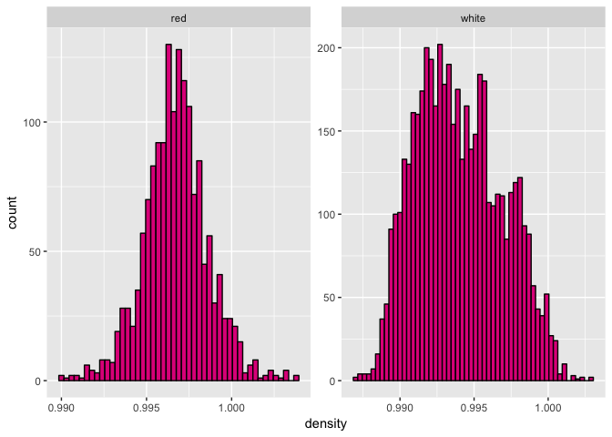
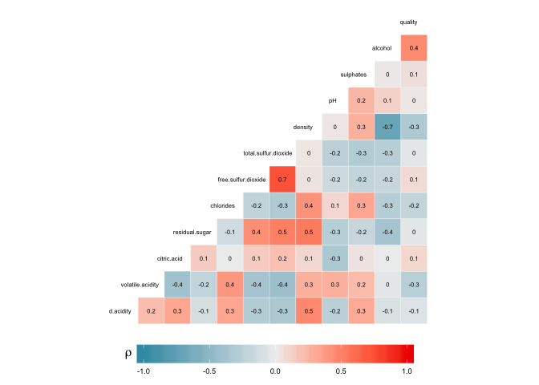
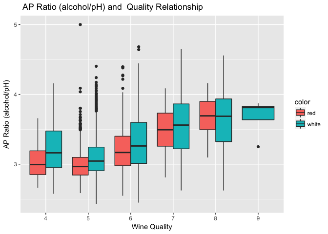

========================================================

# Project Overview

**Exploratory Data Analysis (EDA)** is the numerical and graphical examination of data characteristics and relationships before formal, rigorous statistical analyses are applied. **EDA** can lead to insights, which may uncover to other questions, and eventually predictive models. It also is an important ???line of defense??? against bad data and is an opportunity to notice that your assumptions or intuitions about a data set are violated.

In this project, I will use R and apply exploratory data analysis techniques to explore relationships in one variable to multiple variables and to explore a selected data set for distributions, outliers, and anomalies. 


```
## 'data.frame':	6497 obs. of  13 variables:
##  $ fixed.acidity       : num  7.4 7.8 7.8 11.2 7.4 7.4 7.9 7.3 7.8 7.5 ...
##  $ volatile.acidity    : num  0.7 0.88 0.76 0.28 0.7 0.66 0.6 0.65 0.58 0.5 ...
##  $ citric.acid         : num  0 0 0.04 0.56 0 0 0.06 0 0.02 0.36 ...
##  $ residual.sugar      : num  1.9 2.6 2.3 1.9 1.9 1.8 1.6 1.2 2 6.1 ...
##  $ chlorides           : num  0.076 0.098 0.092 0.075 0.076 0.075 0.069 0.065 0.073 0.071 ...
##  $ free.sulfur.dioxide : num  11 25 15 17 11 13 15 15 9 17 ...
##  $ total.sulfur.dioxide: num  34 67 54 60 34 40 59 21 18 102 ...
##  $ density             : num  0.998 0.997 0.997 0.998 0.998 ...
##  $ pH                  : num  3.51 3.2 3.26 3.16 3.51 3.51 3.3 3.39 3.36 3.35 ...
##  $ sulphates           : num  0.56 0.68 0.65 0.58 0.56 0.56 0.46 0.47 0.57 0.8 ...
##  $ alcohol             : num  9.4 9.8 9.8 9.8 9.4 9.4 9.4 10 9.5 10.5 ...
##  $ quality             : int  5 5 5 6 5 5 5 7 7 5 ...
##  $ color               : Factor w/ 2 levels "red","white": 1 1 1 1 1 1 1 1 1 1 ...
```


- This report explores a dataset containing red and white wine quality and attributes for approximately 6497 wines.
  - Description of attributes:
    - fixed acidity: most acids involved with wine or fixed or nonvolatile (do not evaporate readily)
    - volatile acidity: the amount of acetic acid in wine, which at too high of levels can lead to an unpleasant, vinegar taste
    - citric acid: found in small quantities, citric acid can add 'freshness' and flavor to wines
    - residual sugar: the amount of sugar remaining after fermentation stops, it's rare to find wines with less than 1 gram/liter and wines with greater than 45 grams/liter are considered sweet
    - chlorides: the amount of salt in the wine
    - free sulfur dioxide: the free form of SO2 exists in equilibrium between molecular SO2 (as a dissolved gas) and bisulfite ion; it prevents microbial growth and the oxidation of wine
    - total sulfur dioxide: amount of free and bound forms of S02; in low concentrations, SO2 is mostly undetectable in wine, but at free SO2 concentrations over 50 ppm, SO2 becomes evident in the nose and taste of wine
    - density: the density of water is close to that of water depending on the percent alcohol and sugar content
    - pH: describes how acidic or basic a wine is on a scale from 0 (very acidic) to 14 (very basic); most wines are between 3-4 on the pH scale
    - sulphates: a wine additive which can contribute to sulfur dioxide gas (S02) levels, wich acts as an antimicrobial and antioxidant
    - alcohol: the percent alcohol content of the wine
    - quality: score between 0 and 10
    - color: wine type

# Univariate Plots Section


```
##  [1] "fixed.acidity"        "volatile.acidity"     "citric.acid"         
##  [4] "residual.sugar"       "chlorides"            "free.sulfur.dioxide" 
##  [7] "total.sulfur.dioxide" "density"              "pH"                  
## [10] "sulphates"            "alcohol"              "quality"             
## [13] "color"
```


```
## $red
##  fixed.acidity   volatile.acidity  citric.acid    residual.sugar  
##  Min.   : 4.60   Min.   :0.1200   Min.   :0.000   Min.   : 0.900  
##  1st Qu.: 7.10   1st Qu.:0.3900   1st Qu.:0.090   1st Qu.: 1.900  
##  Median : 7.90   Median :0.5200   Median :0.260   Median : 2.200  
##  Mean   : 8.32   Mean   :0.5278   Mean   :0.271   Mean   : 2.539  
##  3rd Qu.: 9.20   3rd Qu.:0.6400   3rd Qu.:0.420   3rd Qu.: 2.600  
##  Max.   :15.90   Max.   :1.5800   Max.   :1.000   Max.   :15.500  
##    chlorides       free.sulfur.dioxide total.sulfur.dioxide
##  Min.   :0.01200   Min.   : 1.00       Min.   :  6.00      
##  1st Qu.:0.07000   1st Qu.: 7.00       1st Qu.: 22.00      
##  Median :0.07900   Median :14.00       Median : 38.00      
##  Mean   :0.08747   Mean   :15.87       Mean   : 46.47      
##  3rd Qu.:0.09000   3rd Qu.:21.00       3rd Qu.: 62.00      
##  Max.   :0.61100   Max.   :72.00       Max.   :289.00      
##     density             pH          sulphates         alcohol     
##  Min.   :0.9901   Min.   :2.740   Min.   :0.3300   Min.   : 8.40  
##  1st Qu.:0.9956   1st Qu.:3.210   1st Qu.:0.5500   1st Qu.: 9.50  
##  Median :0.9968   Median :3.310   Median :0.6200   Median :10.20  
##  Mean   :0.9967   Mean   :3.311   Mean   :0.6581   Mean   :10.42  
##  3rd Qu.:0.9978   3rd Qu.:3.400   3rd Qu.:0.7300   3rd Qu.:11.10  
##  Max.   :1.0037   Max.   :4.010   Max.   :2.0000   Max.   :14.90  
##     quality        color     
##  Min.   :3.000   red  :1599  
##  1st Qu.:5.000   white:   0  
##  Median :6.000               
##  Mean   :5.636               
##  3rd Qu.:6.000               
##  Max.   :8.000               
## 
## $white
##  fixed.acidity    volatile.acidity  citric.acid     residual.sugar  
##  Min.   : 3.800   Min.   :0.0800   Min.   :0.0000   Min.   : 0.600  
##  1st Qu.: 6.300   1st Qu.:0.2100   1st Qu.:0.2700   1st Qu.: 1.700  
##  Median : 6.800   Median :0.2600   Median :0.3200   Median : 5.200  
##  Mean   : 6.855   Mean   :0.2782   Mean   :0.3342   Mean   : 6.391  
##  3rd Qu.: 7.300   3rd Qu.:0.3200   3rd Qu.:0.3900   3rd Qu.: 9.900  
##  Max.   :14.200   Max.   :1.1000   Max.   :1.6600   Max.   :65.800  
##    chlorides       free.sulfur.dioxide total.sulfur.dioxide
##  Min.   :0.00900   Min.   :  2.00      Min.   :  9.0       
##  1st Qu.:0.03600   1st Qu.: 23.00      1st Qu.:108.0       
##  Median :0.04300   Median : 34.00      Median :134.0       
##  Mean   :0.04577   Mean   : 35.31      Mean   :138.4       
##  3rd Qu.:0.05000   3rd Qu.: 46.00      3rd Qu.:167.0       
##  Max.   :0.34600   Max.   :289.00      Max.   :440.0       
##     density             pH          sulphates         alcohol     
##  Min.   :0.9871   Min.   :2.720   Min.   :0.2200   Min.   : 8.00  
##  1st Qu.:0.9917   1st Qu.:3.090   1st Qu.:0.4100   1st Qu.: 9.50  
##  Median :0.9937   Median :3.180   Median :0.4700   Median :10.40  
##  Mean   :0.9940   Mean   :3.188   Mean   :0.4898   Mean   :10.51  
##  3rd Qu.:0.9961   3rd Qu.:3.280   3rd Qu.:0.5500   3rd Qu.:11.40  
##  Max.   :1.0390   Max.   :3.820   Max.   :1.0800   Max.   :14.20  
##     quality        color     
##  Min.   :3.000   red  :   0  
##  1st Qu.:5.000   white:4898  
##  Median :6.000               
##  Mean   :5.878               
##  3rd Qu.:6.000               
##  Max.   :9.000
```


<!-- -->


- For Red wine:
  - Most quality are 5 or 6, the lowest quality is 3 and the highest quality is 8, the median quality is 6;
- For White wine:
  - Most quality is 6, the loest quality is 3 and the highest quality is 9, the median quality is 6;
- Compare two type wines, more red wine has quality 5 than white wine while white wine has more qualtiy 6 and 7 than red wine;


<!-- -->


- For red wine the lowest fixed acidity is 4.60 and the highest fixed acidity is 15.90, the most common fixed acidity is 7.0; for white wine the lowest fixed acidity is 3.80 and the highest fixed acidity is 14.20. Some fixed acidity occurs more often than other fixed acidity, the most common fixed acidity is 6.8. The white wine seldom has fixed acidity greater than 10. Both two type of wines show normal distribution.


<!-- -->

- For red wine, the lowest volatile acidity is 0.12 and the highest volatile acidity is 1.58. The median volatile acidity is 0.52. I change the histogram binwidth, and it can be seen that there seems to be a binormal distribution. For white wine, the lowest volatile acidity is 0.08 and the highest volatile acidity is 1.10 which are lower than that of red wine and it shows a normal distribution for white wine.


<!-- -->


- Citric acid can add 'freshness' and flavor to wines. For red wine, it shows that there are many wines has 0 citric acid, and only few wines has citric acid greater than 0.8; the lowest citric acid is 0 and the highest citric acid is 1. For whitewine, the lowest citric acid is 0 and the highest citric acid is 1.66, ans it shows a normal distribution.

<!-- -->

- Residual sugar is the amount of sugar remaining after fermentation stopscan. For red wine the minium amount of sugar remained is 0.9 and the maximum remained is 15.5, the most common remianed is 2. For white wine, the minium amount of sugar remained is 0.6 and the maxiumu remained is 65.8 which is much higher than ohters, this can be kept in mind for the outliers, the median amount remianed is 5.2.  Let's look at the range where residual sugar is greater than 20.


<!-- -->

- Only white wine has few samples that residual sugar is greater than 20. I cheat them as outliers. And let's focus on the range where the residual is within 20.


<!-- -->

- From the ploted figure we can see that boty red and white wines' redisual sugar mostly between 1 and 3, I wonder this may be related to the wine quality.


<!-- -->

- Chlorides is the amount of salt in the wine. For red wine, the median chlorides is 0.079, the minimum chlorides is 0.012 and the maximum chlorides is 0.611, which is much higer than the mean value and from the ploted figure, we can see that only few samples have chlorides higher than 0.15. For white wine, the minimum chlorides is 0.009, the maximum chlorides is 0.346, and the median chlorides is 0.043, mostly the amount is within 0.2 for red wine and is within 0.1 for white wine. They all show a normal distribution with long tail. Let's focus on the value below 0.15.

<!-- -->


- Now it is more clear for us to see them. For red wine, it shows a normal distribution while for white wine, there is still a tail, the cholorides for white wine is normally within 0.10 which is a bit lower than that of red wine.]


<!-- -->


- Free sulfur dioxide can prevent microbial growth and the oxidation of wine. For red wine the smallest free sulfur dioxide is 1 and the maximum is 72 and the median is 14; For white wine the median is 34, the smallest free sulfur dioxide is 2 and the maximum free sulfur dioxide is 289 which is much higher than the mean number 35.31, I cheat them as outliers. Les's look at the value greater than 75.


<!-- -->

- There are only one sample with 285 free sulfur dioxide, and only few samples has free sulfur dioxide greater than 75. If we only consider wines with free sulfur dioxide within 75, we can get the figure as shown below:


<!-- -->

- For red wine it shows a right skewed distribution while for white wine it shows a normal distribution.


<!-- -->


- The red wine shows a right skewed distribution and the white wine shows a normal distribution. the trend is the same as the free sulfur dioxide.


<!-- -->


- For red wine the minimum density is 0.9901, the maximum is 1.0037, the median density is 0.9968; For white wine, the median density is 0.9937, the miminum density is 0.9871 and the maximum density is 1.0390. 

<!-- -->

- Only 2 red wines have density greater than 1.01 and only 1 white wine has density greater than 1.01. Let's only focus on the density less than 1.01 for both type of wines.

<!-- -->

- Both two type of wines show normal distribution.


<!-- -->

- For red wine the lowest pH is 2.740, the highest is 4.010, the median pH is 3.310; for white wine, the lowest pH is 2.72 and the highest is 3.82 which are a bit lower than that of red wine. They all show normal distribution.


<!-- -->


- For red wine the median sulphates is 0.62, the minmium sulphates is 0.3300, the maximum is 2.0000, it shows that only few wines' sulphates value is greater than 1.1, we cheat the sulphates greater than 1.1 as outliers; for white wine the median sulphates is 0.47, the minimum sulphates is 0.22 and the maximum is 1.08 which are lower than that of red wines.  

<!-- -->

- Let's only consider sulphates values within 1.1, we can get the figures below:
  - It shows that both type of wine are a bit right skewed. 

<!-- -->


<!-- -->


- For red wine the minimum alcohol is 8.40, the maxiumu is 14.90; for whiht wine the minimum alcohol is 8.00 and the maximum is 14.20 which are a bit lower than that of red wine. 


```
## 'data.frame':	6497 obs. of  15 variables:
##  $ fixed.acidity       : num  7.4 7.8 7.8 11.2 7.4 7.4 7.9 7.3 7.8 7.5 ...
##  $ volatile.acidity    : num  0.7 0.88 0.76 0.28 0.7 0.66 0.6 0.65 0.58 0.5 ...
##  $ citric.acid         : num  0 0 0.04 0.56 0 0 0.06 0 0.02 0.36 ...
##  $ residual.sugar      : num  1.9 2.6 2.3 1.9 1.9 1.8 1.6 1.2 2 6.1 ...
##  $ chlorides           : num  0.076 0.098 0.092 0.075 0.076 0.075 0.069 0.065 0.073 0.071 ...
##  $ free.sulfur.dioxide : num  11 25 15 17 11 13 15 15 9 17 ...
##  $ total.sulfur.dioxide: num  34 67 54 60 34 40 59 21 18 102 ...
##  $ density             : num  0.998 0.997 0.997 0.998 0.998 ...
##  $ pH                  : num  3.51 3.2 3.26 3.16 3.51 3.51 3.3 3.39 3.36 3.35 ...
##  $ sulphates           : num  0.56 0.68 0.65 0.58 0.56 0.56 0.46 0.47 0.57 0.8 ...
##  $ alcohol             : num  9.4 9.8 9.8 9.8 9.4 9.4 9.4 10 9.5 10.5 ...
##  $ quality             : int  5 5 5 6 5 5 5 7 7 5 ...
##  $ color               : Factor w/ 2 levels "red","white": 1 1 1 1 1 1 1 1 1 1 ...
##  $ acid_level          : Factor w/ 4 levels "High","Moderately High",..: 4 2 3 2 4 4 3 4 4 4 ...
##  $ grade               : Factor w/ 4 levels "bad","ok","good",..: 2 2 2 3 2 2 2 4 4 2 ...
```


```
## 'data.frame':	6346 obs. of  15 variables:
##  $ fixed.acidity       : num  7.4 7.8 7.8 11.2 7.4 7.4 7.9 7.3 7.8 7.5 ...
##  $ volatile.acidity    : num  0.7 0.88 0.76 0.28 0.7 0.66 0.6 0.65 0.58 0.5 ...
##  $ citric.acid         : num  0 0 0.04 0.56 0 0 0.06 0 0.02 0.36 ...
##  $ residual.sugar      : num  1.9 2.6 2.3 1.9 1.9 1.8 1.6 1.2 2 6.1 ...
##  $ chlorides           : num  0.076 0.098 0.092 0.075 0.076 0.075 0.069 0.065 0.073 0.071 ...
##  $ free.sulfur.dioxide : num  11 25 15 17 11 13 15 15 9 17 ...
##  $ total.sulfur.dioxide: num  34 67 54 60 34 40 59 21 18 102 ...
##  $ density             : num  0.998 0.997 0.997 0.998 0.998 ...
##  $ pH                  : num  3.51 3.2 3.26 3.16 3.51 3.51 3.3 3.39 3.36 3.35 ...
##  $ sulphates           : num  0.56 0.68 0.65 0.58 0.56 0.56 0.46 0.47 0.57 0.8 ...
##  $ alcohol             : num  9.4 9.8 9.8 9.8 9.4 9.4 9.4 10 9.5 10.5 ...
##  $ quality             : int  5 5 5 6 5 5 5 7 7 5 ...
##  $ color               : Factor w/ 2 levels "red","white": 1 1 1 1 1 1 1 1 1 1 ...
##  $ acid_level          : Factor w/ 4 levels "High","Moderately High",..: 4 2 3 2 4 4 3 4 4 4 ...
##  $ grade               : Factor w/ 4 levels "bad","ok","good",..: 2 2 2 3 2 2 2 4 4 2 ...
```

In order to better understand the wine quality, I removed NA data, and I sperated the wine to four grade: 


| Wine Quality  | Wine Quality Grade |
|:-------------:|:------------------:|
| [3.000,4.000) |        bad         |
| [4.000,5.000) |         ok         |
| [5.000,6.000) |        good        |
| [6.000,9.000] |       great        |
|               |                    |

<!-- -->

- We can see that mostly wine quality is ok or good level for both red and white wine, only around 0.1~0.2 pencent wines are great grade level. For this discussed dataset, white wine's quality is a bit good than red wine.
c(2.720,3.110,3.219,3.320,4.010), labels = c('High','Moderately High','Medium','Low'))
I also seperate the pH to four acid level:


|    Wine pH    | Wine Acid Level |
|:-------------:|:---------------:|
| [2.720,3.110) |      High       |
| [3.110,3.219) | Moderately High |
| [3.219,3.320) |     Medium      |
| [3.320,4.010] |       Low       |
|               |                 |

<!-- -->

- We can see from the ploted figure above, for red wine, mostly the acide level is low while for white wine, more wines' acid level is high, which is oppsite than that of red wine. I wonder whether the acid level is related to the quality. And I am interested in what is the relationship, negative or positive.


# Univariate Analysis

1. What is the structure of your dataset?
  - There are 1599 redwines and 4898 white wines in the dataset, total 6497 wines with 13 features (fixed acidity, volatile acidity, citric acid, residual sugar, chlorides, free sulfur dioxide, total sulfur dioxide, density, pH, sulphates, alcohol, quality, and color). And the variables are numerical ordered. 

2. Other observations:
  - For red wines, mostly the quality is 6, the pH is 3.310 and the alcohol is 10.20; for white wines, mostly the quality is 6, the pH is 3.18 and the alcohol is 10.4.

3. What is/are the main feature(s) of interest in your dataset?
  - After above wine quality assessment, it appears to me that aicd, pH, residual sugar and alcohol are the main features of interest when determining the wine quality. I???d like to see which features are best for determine the quality of the wine. I also suspect some combination of the variables that can be used to build a predictive model to quality red wine.

4. What other features in the dataset do you think will help support your \
investigation into your feature(s) of interest?
  - Whether density, pH levels have a direct link with subjective wine quality.

5. Did you create any new variables from existing variables in the dataset?
  - I created two new variables ???acid_level??? and "grade". Both pH and quality are given as numeric and I converted them to catogorical variable with the following mapping:
    - acid_level:
      - [2.720,3.110): High
      - [3.110,3.219): Moderately High
      - [3.219,3.320): Medium
      - [3.320,4.010]: Low
    - grade:
      - [3.000,4.000): bad
      - [4.000,5.000): ok
      - [5.000,6.000): good
      - [6.000,9.000]: great

6. Of the features you investigated, were there any unusual distributions? 
  - Citric acid shows a bit unusual because it displays an overal uniform distribution while having a huge peak at the lower level. 
  - For the other distributions, there are some outliers appears in redidual sugar, free sulfur dioxide, density and sulphates. I droped those outliers and generated a new data frame call 'wine_modified'.
 

# Bivariate Plots Section

- The first thing I want to do is ploting key variables against each other using GGcorr function. Through the ploted figure, I can see what might be relationships between quality. 


```
## Warning in ggcorr(wine_modified, name = expression(rho), legend.position
## = "bottom", : data in column(s) 'color', 'acid_level', 'grade' are not
## numeric and were ignored
```

<!-- -->


<!-- -->

- For different grades??? fixed.acidity, the distribution is different. We can also use boxplots and scatterplots to visualize them as follows, which are more intuitive.


<!-- -->


- It seems like red wine has higer fixed acidity and volatile acidity than that of white wine for different quality while for citiric acidity, the red wine is lower that white wine for certain level.


<!-- -->


- For different quality wines, red wines normall has low residual sugar than that of white wine, and for white wine, the residual sugar value is between 0 to 20; For pH and Alcohol, there seems relatively same distribution for boty type wine, and it seems that the alcohol increases with higher quality.


<!-- -->


- For residual sugar, the good grade is more uniform distributed than other grades and mostly the residual sugar are within 5, it shows a right skewed with long tail; for chlorides, there is ralatively low chlorides for all different grades and it shows a right skewed distribution; for sulphates, it is uniform distributed for different grades; for density, good grade shows relatively low density, but the different between different grades is not too obvious, it shows that good and great grade wine have relatively lower density than bad and ok grade wine; for pH, it shows normal distribution; for alcohol, it seems that good grade wine has higher alcohol level than ohter grades; for total sulfur dioxide, it shows binominal distribution, which can be caused by two type wines, we can see more clear if we plot the total sulfur dioxide by wine type.


<!-- -->

- Now it is more clear for us that red wine has lower total sulfur dioxide and it shows a right skewed distribution, while white wine has higher total sulful dioxide.

# Bivariate Analysis

1. Talk about some of the relationships you observed in this part of the investigation. How did the feature(s) of interest vary with other features in the dataset?
  - I mostly observe the factors affecting wine quality, and by looking at the relationship between quality/grade and other variables, it is clear that there is a relationship between wine quality and these variables:
    - Positive relationship: fixed.acidity, citric.acid, sulphates, alcohol, sulfur dioxide for white wine
    - Negative relationship: volatile.acidity, density, pH, sulfur dioxide for red wine


2. Did you observe any interesting relationships between the other features \
(not the main feature(s) of interest)?
  - From the above observations, it appears that residual sugar does not have a clear relationship with quality which is not the same as what I expected. 


3. What was the strongest relationship you found?
  - The stongest relationship I found is between volatile acidity and quality. It shows that the volatile acidity level decreases as the quality goes up.

# Multivariate Plots Section

<!-- -->

<!-- -->

- Alcohol exhibited a strong negative correlation with density for boty type of wines while residual sugar shows a strong positive correlation with density for both type of wines.


<!-- -->

total.sulfur.dioxide
  - It shows a negative relationship between alcohol and total sulfur dioxide where the total sulfur dioxide decreases when alcohol goes up;
  - White wine shows higer total sulfur dioxide than that of red wine across all alcohol level.
  
free.sulfur.dioxide
  - It shows a negative relationship between alcohol and free sulfur dioxide where the free sulfur dioxide decreases when alcohol goes up;
  - White wine exhibits higer free sulfur dioxide than that of red wine across all alcohol level, too.

Chloride
  - It shows a negative relationship between alcohol and chloride. The chloride content is quite high at lower alcohol level and it shows a significant reduction, when alcohol level goes to around 13, the chloride increases again. 
  - Red wine has a higher chloride content than that of white wine across all alcohol level.
  


<!-- -->

- From the plot figure above we can see that the AP Ratio keep increasing when the wine quality increases.

<!-- -->

- We can see that for red wine, the RP ratio doesn't effect a lot, while for white wine, the RP ratio decreases a lot with the increasement of alcohol and tends to be gentle after alchol value above 10; 

<!-- -->

- If we look more detail into different wine grade, we can see that the RP ratio decrease when the alcohol increases, which has similar trend than that of white wine;


```
## List of 2
##  $ axis.title:List of 11
##   ..$ family       : NULL
##   ..$ face         : chr "bold"
##   ..$ colour       : NULL
##   ..$ size         : num 10
##   ..$ hjust        : NULL
##   ..$ vjust        : NULL
##   ..$ angle        : NULL
##   ..$ lineheight   : NULL
##   ..$ margin       : NULL
##   ..$ debug        : NULL
##   ..$ inherit.blank: logi FALSE
##   ..- attr(*, "class")= chr [1:2] "element_text" "element"
##  $ axis.text :List of 11
##   ..$ family       : NULL
##   ..$ face         : NULL
##   ..$ colour       : NULL
##   ..$ size         : num 7
##   ..$ hjust        : NULL
##   ..$ vjust        : NULL
##   ..$ angle        : NULL
##   ..$ lineheight   : NULL
##   ..$ margin       : NULL
##   ..$ debug        : NULL
##   ..$ inherit.blank: logi FALSE
##   ..- attr(*, "class")= chr [1:2] "element_text" "element"
##  - attr(*, "class")= chr [1:2] "theme" "gg"
##  - attr(*, "complete")= logi FALSE
##  - attr(*, "validate")= logi TRUE
```

<!-- -->

- This final plot shows that APR ratio decreases when the wine density increase, red wine has higher density than white wine; and according to the second plot, we can see that the APR increase when wine quality increases while for white wine, there seems no rules to follow.


# Multivariate Analysis

1. Talk about some of the relationships you observed in this part of the investigation. Were there features that strengthened each other in terms of looking at your feature(s) of interest?
  - With the above exploration, it shows to me that pH, residual sugar and alcohol do afect the wine quality and they should be cheat as the main factors.


2. Were there any interesting or surprising interactions between features?
  - I explored among various groups of variables and I try to plot alcohol/pH ratio by boxplot, and it shows difference between different quality groups, indicating pH and alcohol might be the two most important factors in determining wine quality.
  - I also plot the scatter plot of residual.sugar/pH and alcohol and it shows that with the increasemetn of alcohol level, the RP ration decreases.

------

# Final Plots and Summary

## Plot One


```
## List of 2
##  $ axis.title:List of 11
##   ..$ family       : NULL
##   ..$ face         : chr "bold"
##   ..$ colour       : NULL
##   ..$ size         : num 10
##   ..$ hjust        : NULL
##   ..$ vjust        : NULL
##   ..$ angle        : NULL
##   ..$ lineheight   : NULL
##   ..$ margin       : NULL
##   ..$ debug        : NULL
##   ..$ inherit.blank: logi FALSE
##   ..- attr(*, "class")= chr [1:2] "element_text" "element"
##  $ axis.text :List of 11
##   ..$ family       : NULL
##   ..$ face         : NULL
##   ..$ colour       : NULL
##   ..$ size         : num 7
##   ..$ hjust        : NULL
##   ..$ vjust        : NULL
##   ..$ angle        : NULL
##   ..$ lineheight   : NULL
##   ..$ margin       : NULL
##   ..$ debug        : NULL
##   ..$ inherit.blank: logi FALSE
##   ..- attr(*, "class")= chr [1:2] "element_text" "element"
##  - attr(*, "class")= chr [1:2] "theme" "gg"
##  - attr(*, "complete")= logi FALSE
##  - attr(*, "validate")= logi TRUE
```

<!-- -->

## Description One

This scatter plot shows the relationship between the APR ratio (alcohol:pH:residual sugar) and density. It shows that the APR ratio decreases when density increases. And the APR ratio effects the wine quality for red wine but not for the white wine.


## Plot Two

<!-- -->

## Description Two

This figure shows the different variables distribution according to the wine grade, including the main interested variables: pH, residual sugar and alcohol. For residual sugar, mostly the value is within 5, for pH, it shows normal distribution and for alcohol, it shows that mostly good wine has higher alcohol level.

## Plot Three

<!-- -->

## Description Three

This plot uses a boxplot to show the different attributes across different quality levels.The x-axis is wine quality and the y-axis is the AP ratio (alcohol:pH). The AP ratio increases with the increasement of wine quality. The following is the supporting summary statistics:


```
## wine_modified$quality: 4
##    Min. 1st Qu.  Median    Mean 3rd Qu.    Max. 
##   2.575   2.900   3.122   3.161   3.355   4.158 
## -------------------------------------------------------- 
## wine_modified$quality: 5
##    Min. 1st Qu.  Median    Mean 3rd Qu.    Max. 
##   2.432   2.881   3.012   3.070   3.182   5.000 
## -------------------------------------------------------- 
## wine_modified$quality: 6
##    Min. 1st Qu.  Median    Mean 3rd Qu.    Max. 
##   2.450   3.000   3.235   3.299   3.548   4.681 
## -------------------------------------------------------- 
## wine_modified$quality: 7
##    Min. 1st Qu.  Median    Mean 3rd Qu.    Max. 
##   2.624   3.242   3.549   3.533   3.820   4.648 
## -------------------------------------------------------- 
## wine_modified$quality: 8
##    Min. 1st Qu.  Median    Mean 3rd Qu.    Max. 
##   2.623   3.356   3.687   3.627   3.932   4.558 
## -------------------------------------------------------- 
## wine_modified$quality: 9
##    Min. 1st Qu.  Median    Mean 3rd Qu.    Max. 
##   3.250   3.636   3.811   3.679   3.828   3.872
```

------

# Reflection

In this project, I learn skills to frame and present data. Data, by itself, is "ubiquitous and cheap," says Google's Chief Economist and UC Berkeley professor Hal Varian. What I do as a data analyst is take that data and turn it into insights.

I started by looking at the individual variable and trying to explore by group variables. With the exploration with different variables, I have had a more depth understanding of variables affecting the wine qualities. I download both red and white wine data and use python pandas package to combine the data to generate the new data frame. I examine the NA data, and outliers which will affect the later exploration. I also generate new variables, such as grade and acid_level where I convert the numeric variables to catogorical varibles. Follow by the data analysis generally procedure, I finally can get the relationship of different variables with wine quality. And I think this is where my skill grow. 

On the other hand, I think better understanding of the variables, to be more specificly, what the variables means if also important. This will help us to think the relationship between those variables. But I did't generate the model for predicting wine quality. I will focus more on modelign part which is import for data analysis.

After completing the project:

  - I understand the distribution of a variable and to check for anomalies and outliers
  - I learnt how to quantify and visualize individual variables within a data set by using appropriate plots such as scatter plots, histograms, bar charts, and box plots
  - I explored variables to identify the most important variables and relationships within a data set before building predictive models; calculate correlations, and investigate conditional means
  - I learnt powerful methods and visualizations for examining relationships among multiple variables, such as reshaping data frames and using aesthetics like color and shape to uncover more information


